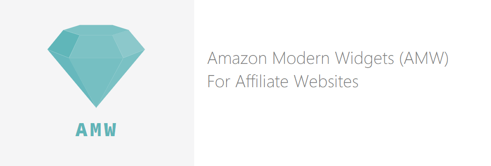
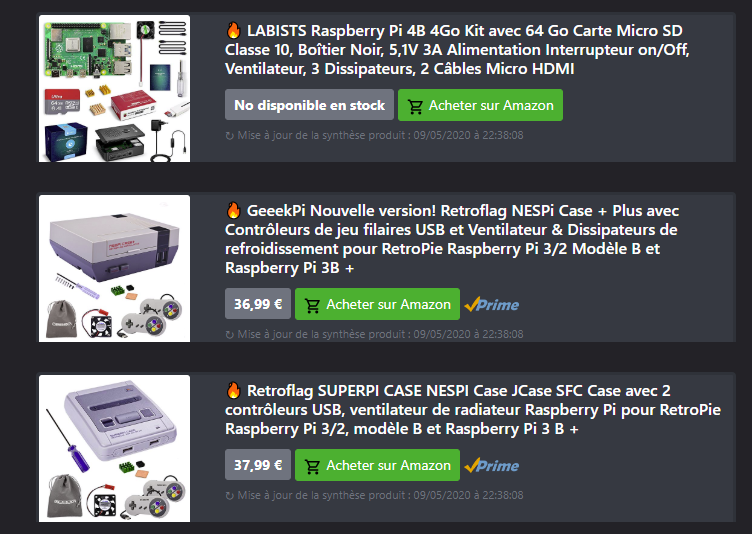

The default Amazon Widgets provided by Amazon to their partners are not optimized and need some improvments in terms of user experience.
The goal of AMW is to provide Amazing Amazon Widgets for your website with attractive and modern UX/UI.

The AMW project provides : 
- RestFull APIs to simplify the Amazon PAAPI 5 integration for Websites.
- A collection of product widgets with aysnc data loading and bootstrap integration.

The goal of AMW is to provide an alternative a simple and a modern solution to integrate Amazon product description to your website.
AMW can be integrated on all the CMS : Ghost, Joomla, Dotclear, Drupal, Wordpress ...

## Start AMW

Configure the "config/production.yml" based on "config/default.yml" file with your Amazon Partner information and then :

```bash
$ npm install
$ npm start
```

If you want to keep AMW up, you can use PM2 to manage the lifecycle of AMW :

```bash
$ sudo npm install pm2 -g
$ pm2 start server.js
$ pm2 startup
... Run the command displayed by pm2.
$ pm2 save
```

## Expose the AMW services to your website

If you use NGINX as a webserver, you can easily create a reverse proxy to the NodeJS daemon.
On the example bellow the AMW APIs will be available under "/amazon" path on your website.

```
location ^~ /amazon {
    proxy_set_header Host $http_host;
    proxy_set_header X-Real-IP $remote_addr;
    proxy_set_header X-Forwarded-For $proxy_add_x_forwarded_for;
    proxy_set_header X-Forwarded-Proto $scheme;
    proxy_pass  http://127.0.0.1:8080;
    proxy_read_timeout 600;
}
```

## Optimize the AMW performance

The Amazon Product API are limited by quota : 
* 1 request per second and a cumulative daily maximum of 8640 requests per day for the first 30 days.
* 1 call for every 5 cents of shipped item revenue generated.

To limit the number of calls to Amazon API, two solutions can be setup : 
* You have a Redis instance, and you enable the caching option in the AMW config file.
* You use NGINX and you configure a micro-caching strategy to keep in memory the results of the AMW APIs.

## Integrate the widget to your Website

Integrate a product widget to your Website based on a product ID that you can found in the Amazon URL : 

```html
<iframe src="https://your-server/amazon/card?id=B084DN3XVN" scrolling="no" 
frameborder="no" loading="lazy" style="width:100%"></iframe>
```

or search a product based on a keyword : 

```html
<iframe src="https://your-server/amazon/card?keyword=arduino" scrolling="no" 
frameborder="no" loading="lazy" style="width:100%"></iframe>
```

## Sample of AMW integration




## List of the API available

Generate a full HTML card for an Amazon product : 
* http://localhost:8080/amazon/card?id=B0192CTN72
* http://localhost:8080/amazon/card?keyword=arduino

Return JSON a description for an Amazon product : 
* http://localhost:8080/amazon/product?id=B0192CTN72
* http://localhost:8080/amazon/product?keyword=arduino

## More information on AMW

* [Affiliation Amazon : Amazon Modern Widgets (AMW)](https://www.geeek.org/amazon-affiliation-modern-widgets/)
* (share your blog posts ludovic@toinel.com)