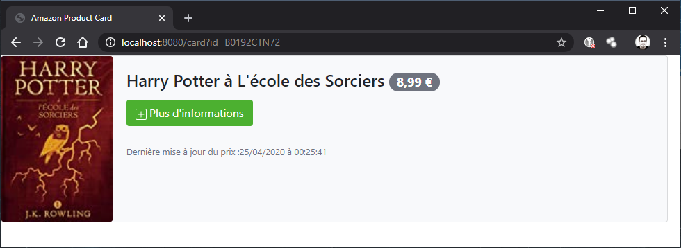

# Amazon Product Card
Amazon Product Card is a node JS Gateway with Redis cache for Amazon PAAPI 5.

Amazon Product Card can help you to integrate Amazon product into your website with fresh information about the availability and the price.

Amazon Product Card provides : 
- RestFull API to simplify the Amazon PAAPI 5 integration
- Samples of product cards with aysnc data loading and bootstrap integration



## Sample of use

Generate an HTML card for an Amazon product : 
http://localhost:8080/card?id=B0192CTN72

Return JSON a description for an Amazon product : 
http://localhost:8080/product?id=B0192CTN72


## Start the project

Configure the /etc/default.yml configuration file and then :

```console
$ npm install
$ npm start
```