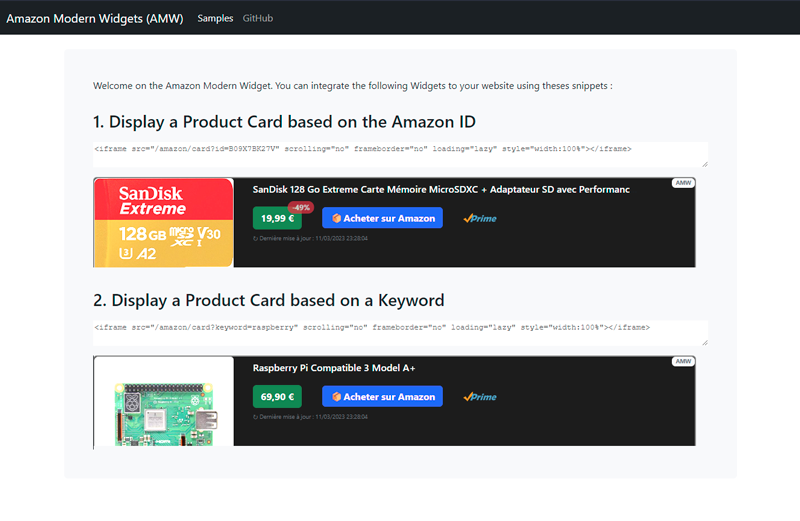

  


The standard Amazon Widgets provided by Amazon to its partners are not optimised and need some improvements in terms of user experience.
The goal of AMW is to provide Amazing Amazon Widgets for your website with attractive and modern UX/UI.

The AMW project provides : 
- RestFull APIs to simplify Amazon PAAPI 5 integration for websites.
- A collection of product widgets with aysnc data loading and bootstrap integration.

The goal of AMW is to provide an alternative, simple and modern solution to integrate Amazon product descriptions into your website.
AMW can be integrated with all CMS: Ghost, Joomla, Dotclear, Drupal, Wordpress ...

## Start the AMW server

Configure the "config/production.yml" file with your Amazon partner information and then :

```bash
$ npm install
$ npm start
```

If you want to keep AMW up and running, you can use PM2 to manage the lifecycle of AMW:

```bash
sudo npm install pm2 -g
$ pm2 start dist/src/main.js
$ pm2 startup
... Execute the command displayed by pm2.
$ pm2 save
```

You can check your installation with your browser by opening the following URL : http://localhost:8080/amazon/
You should see two widgets if your installation is ready to use.




## Exposing the AMW services to your website

If you are using NGINX as your web server, you can easily create a reverse proxy to the NodeJS daemon.
In the example below, the AMW APIs will be available under the "/amazon" path on your website.

```
location ^~ /amazon {
    proxy_set_header Host $http_host;
    proxy_set_header X-Real-IP $remote_addr;
    proxy_set_header X-Forwarded-For $proxy_add_x_forwarded_for;
    proxy_set_header X-Forwarded-Proto $scheme;
    proxy_pass http://127.0.0.1:8080;
    proxy_read_timeout 600;
}
```

## Optimise AMW performance

The Amazon Product API is limited by quotas: 
* 1 request per second and a cumulative daily limit of 8640 requests per day for the first 30 days.
* 1 call for every 5 cents of revenue generated from shipped items.

To limit the number of calls to the Amazon API, two solutions can be set up: 
* You have a Redis instance and you enable the caching option in the AMW config file.
* You can use NGINX and configure a micro-caching strategy to keep the results of the AMW APIs in memory.
* You can also use a CDN to cache the product data and avoid multiple call to Amazon APIs.

## Integrate the AMW widgets into your website

Integrate a product widget into your site based on a product ID that you can find in the Amazon URL: 

```html
<iframe src="https://your-server/amazon/card?id=B084DN3XVN" scrolling="no" 
frameborder="no" load="lazy" style="width:100%"></iframe>.
```

or search for a product by keyword: 

```html
<iframe src="https://your-server/amazon/card?keyword=arduino" scrolling="no" 
frameborder="no" loading="lazy" style="width:100%"></iframe>.
```

## Example of AMW integration


## AMW API available

Generate a full HTML card for an Amazon product: 
* http://localhost:8080/amazon/card?id=B0192CTN72
* http://localhost:8080/amazon/card?keyword=arduino

Return a JSON description for an Amazon product : 
* http://localhost:8080/amazon/product?id=B0192CTN72
* http://localhost:8080/amazon/product?keyword=arduino

## More information

* [Amazon affiliate: Amazon Modern Widgets (AMW)](https://www.geeek.org/amazon-affiliation-modern-widgets/)
* (share your blog posts ludovic@toinel.com)

## Licence
Licence
© Ludovic Toinel, 2023

Released under the MIT licence