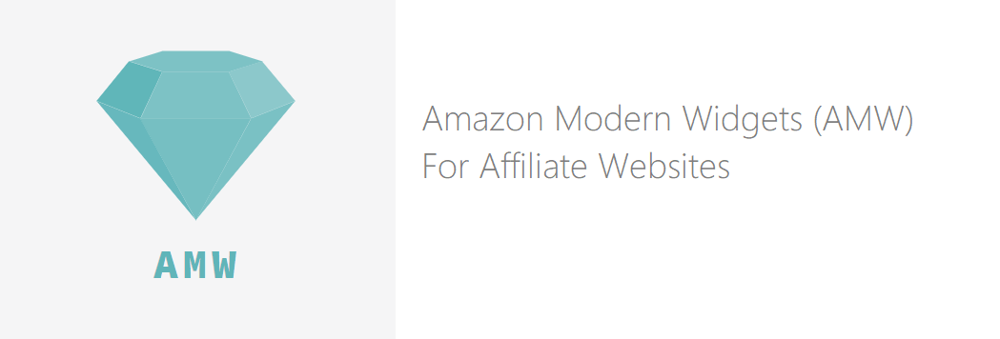
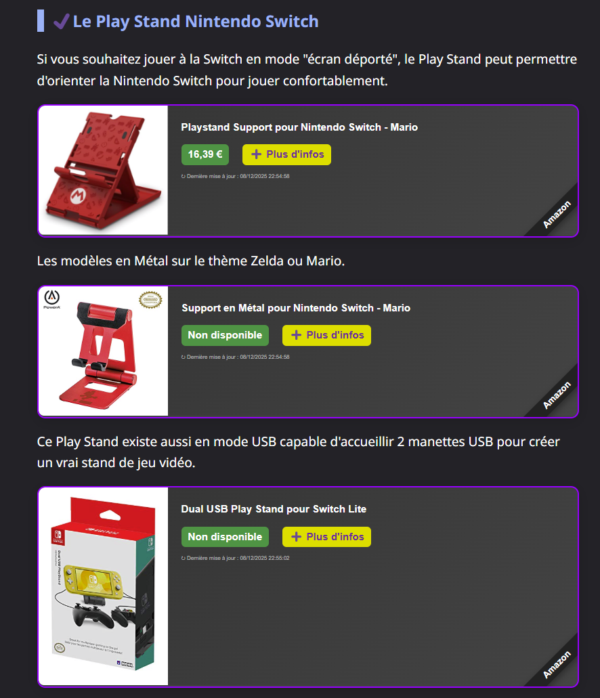

## 📦 Installation

### NPM Package
```bash
npm install amazon-modern-widgets
```

### Docker Image
```bash
docker pull ltoinel/amw:latest
# or
docker pull ghcr.io/ltoinel/amw:latest
```

## 📚 Documentation & Testing

- **[📖 Complete Project Documentation](spec/)** - All comprehensive documentation is organized in the `/spec` directory
- **[🎯 Project Enhancement Summary](spec/00-project-enhancement-summary.md)** - Complete v3.0.0 transformation overview
- **[🧪 Unit Tests Documentation](spec/09-unit-tests-documentation.md)** - Detailed Jest test suite documentation
- **[🚀 CI/CD Pipeline Documentation](spec/11-ci-cd-documentation.md)** - GitHub Actions workflows and automation
- **✅ Test Coverage:** 100 tests passed across 7 test suites (~5s execution)
- **🔧 Updated Endpoints:** All APIs now available under `/amw` prefix

---

The standard Amazon Widgets provided by Amazon to its partners are not optimised and need some improvements in terms of user experience.
The goal of AMW is to provide Amazing Amazon Widgets for your website with attractive and modern UX/UI.

## ✨ Features & Improvements (v3.0.0)

The AMW project provides : 
- **RESTful APIs** to simplify Amazon PAAPI 5 integration for websites
- **Modern JavaScript Widget** with responsive design, async loading, and full clickability
- **Dual Integration Methods** - Modern widget.js or traditional iframe support
- **Docker Support** with simplified single-environment setup (AMW + Redis)
- **Comprehensive Test Coverage** with 100 Jest unit tests ensuring reliability (100% pass rate)
- **Updated API Endpoints** now available under `/amw` prefix with dedicated `/health` endpoint
- **Enhanced Documentation** with detailed specifications, testing guides, and release process
- **TypeScript Support** for improved development experience and type safety
- **Redis Caching** for optimal performance and API quota management
- **CI/CD Automation** with GitHub Actions workflows for testing, building, and multi-registry publishing
- **Multi-Registry Publishing** - Automated releases to NPM, Docker Hub, and GitHub Container Registry
- **Production Ready** with security best practices, health monitoring, and automated deployment pipelines
- **Clean Code** - Zero ESLint errors/warnings with modern ES2022+ standards

The goal of AMW is to provide an alternative, simple and modern solution to integrate Amazon product descriptions into your website.
AMW can be integrated with all CMS: Ghost, Joomla, Dotclear, Drupal, Wordpress ...

## Start the AMW server

Configure the "config/production.yml" file with your Amazon partner information and then :

```bash
$ npm install
$ npm start
```

If you want to keep AMW up and running, you can use PM2 to manage the lifecycle of AMW:

```bash
sudo npm install pm2 -g
$ pm2 start dist/src/main.js
$ pm2 startup
... Execute the command displayed by pm2.
$ pm2 save
```

## 🐳 Docker Deployment (Recommended)

AMW includes Docker support for easy deployment and scalability:

### Quick Start with Docker Compose

```bash
# Clone and configure
git clone https://github.com/ltoinel/amw.git
cd amw
cp config/sample.yml config/production.yml
# Edit config/production.yml with your Amazon credentials

# Start all services (AMW + Redis)
npm run docker

# Or manually with Docker Compose
cd docker
docker-compose up -d

# Check services status
docker-compose ps

# View logs
docker-compose logs -f amw
```

### Docker Build Only

```bash
# Build the Docker image
cd docker
./scripts/build.sh

# Or manually
docker build -f docker/Dockerfile -t amw:latest .

# Run AMW container
docker run -d \
  --name amw \
  -p 8080:8080 \
  -v ./config/production.yml:/app/config/production.yml:ro \
  amw:latest

# Check container health
docker ps
```

### Production Deployment Features

- ✅ **Multi-stage build** for optimized image size (~150MB)
- ✅ **Non-root user** for enhanced security
- ✅ **Health checks** with dedicated `/amw/health` endpoint
- ✅ **Redis integration** for optimal caching
- ✅ **Organized structure** - Scripts in `docker/scripts/`, configs in `docker/config/`
- ✅ **Volume mounting** for configuration and logs
- ✅ **Signal handling** with dumb-init
- ✅ **Simplified deployment** - No dev/prod distinction, production-ready by default

## Exposing the AMW services to your website

If you are using NGINX as your web server, you can easily create a reverse proxy to the NodeJS daemon.
In the example below, the AMW APIs will be available under the "/amw" path on your website.

```
location ^~ /amw {
    proxy_set_header Host $http_host;
    proxy_set_header X-Real-IP $remote_addr;
    proxy_set_header X-Forwarded-For $proxy_add_x_forwarded_for;
    proxy_set_header X-Forwarded-Proto $scheme;
    proxy_pass http://127.0.0.1:8080;
    proxy_read_timeout 600;
}
```

## Optimise AMW performance

The Amazon Product API is limited by quotas: 
* 1 request per second and a cumulative daily limit of 8640 requests per day for the first 30 days.
* 1 call for every 5 cents of revenue generated from shipped items.

To limit the number of calls to the Amazon API, two solutions can be set up: 
* You have a Redis instance and you enable the caching option in the AMW config file.
* You can use NGINX and configure a micro-caching strategy to keep the results of the AMW APIs in memory.
* You can also use a CDN to cache the product data and avoid multiple call to Amazon APIs.

## 🎯 Integrate AMW Widgets into Your Website

AMW offers **two integration methods** to suit different needs and technical requirements:

### 📱 Method 1: Modern JavaScript Widget (Recommended)

**Modern, responsive, and customizable** - Use the AMW JavaScript widget for the best user experience:

```html
<!-- Include the AMW widget script -->
<script src="https://your-server/amw/widget.js"></script>

<!-- Create widget containers with data attributes -->
<div class="amw-widget" data-id="B084DN3XVN"></div>
<div class="amw-widget" data-keyword="arduino"></div>
```

**✅ Advantages:**
- **Responsive design** - Automatically adapts to screen size
- **Modern styling** - Bootstrap 5 integration with custom themes
- **Better performance** - Async loading and client-side caching
- **SEO friendly** - Content is indexed by search engines
- **Customizable** - Easy styling and theme options
- **Progressive enhancement** - Works with JavaScript disabled

### 🖼️ Method 2: Traditional iframe Integration (DEPRECATED)

**Simple plug-and-play** - Use iframes for quick integration without JavaScript dependencies:

```html
<!-- Product by ID -->
<iframe src="https://your-server/amw/card?id=B084DN3XVN" 
        scrolling="no" frameborder="no" loading="lazy" 
        style="width:100%; height:300px;"></iframe>

<!-- Product by keyword -->
<iframe src="https://your-server/amw/card?keyword=arduino" 
        scrolling="no" frameborder="no" loading="lazy" 
        style="width:100%; height:300px;"></iframe>
```

**✅ Advantages:**
- **Simple integration** - No JavaScript knowledge required
- **Isolated styling** - Widget styles don't affect your site
- **Security** - Sandboxed content
- **CMS friendly** - Works in any content management system

**⚠️ Limitations:**
- Fixed sizing (requires manual height adjustment)
- Less responsive on mobile devices
- SEO content not indexed by search engines

### 🎯 Which Method Should You Choose?

| Use Case | Recommended Method | Why? |
|----------|-------------------|------|
| **Modern website with build process** | JavaScript Widget | Better performance, SEO, responsive design |
| **E-commerce/Product pages** | JavaScript Widget | Better user experience and conversion rates |
| **Blog/Content sites** | JavaScript Widget | SEO benefits and responsive design |
| **Quick prototyping** | iframe | Faster implementation, no setup required |
| **Legacy CMS (older versions)** | iframe | Better compatibility with older systems |
| **Email newsletters** | iframe | JavaScript not supported in most email clients |

## Example of AMW integration




## 🔌 AMW API Endpoints

AMW provides multiple endpoints to support both integration methods:

### Widget Resources
* **JavaScript Widget:** `GET /amw/widget.js` - Modern widget script for client-side integration
* **HTML Cards:** `GET /amw/card?id={ASIN}` or `GET /amw/card?keyword={term}` - Complete HTML for iframe integration

### Data APIs  
* **Product Data (JSON):** `GET /amw/product?id={ASIN}` or `GET /amw/product?keyword={term}` - Raw product data for custom implementations

### Examples
```bash
# Modern widget JavaScript
curl https://localhost:8080/amw/widget.js

# HTML card for iframe
curl "https://localhost:8080/amw/card?id=B0192CTN72"
curl "https://localhost:8080/amw/card?keyword=arduino"

# JSON product data
curl "https://localhost:8080/amw/product?id=B0192CTN72"
curl "https://localhost:8080/amw/product?keyword=arduino"
```

## 🛠️ Development & Testing

The project includes comprehensive development tools and scripts:

### 📋 Available NPM Scripts

#### Essential Scripts
```bash
# Build TypeScript to JavaScript
npm run build

# Clean build directory
npm run clean

# Start production server (auto-builds)
npm start

# Development mode with auto-reload
npm run dev

# Run all tests
npm test

# Run tests with coverage report
npm run test:coverage

# Run tests for CI (non-interactive)
npm run test:ci

# Lint TypeScript code
npm run lint

# Fix linting errors automatically
npm run lint:fix

# Start Docker services
npm run docker

# Release to GitHub/NPM/Docker Hub
npm run release
```

### 🤖 GitHub Actions CI/CD

AMW includes comprehensive GitHub Actions workflows for automated testing, building, and deployment:

#### 🧪 Continuous Integration (`ci.yml`)
- **Triggers:** Push to `main`/`develop`, Pull requests
- **Node.js versions:** 18, 20, 22 (matrix testing)
- **Steps:** Install → Lint → Build → Test
- **Features:**
  - ✅ Zero lint errors/warnings enforcement
  - ✅ 100 tests pass requirement
  - ✅ Multi-version Node.js compatibility
  - ✅ Fast feedback loop (~30 seconds)

#### 🚀 Release & Deploy (`release.yml`)
- **Triggers:** Git tags (`v*.*.*`)
- **Steps:** Test → Build → NPM publish → Docker publish → GitHub release
- **Registries:**
  - 📦 NPM - `amazon-modern-widgets` package
  - 🐳 Docker Hub - `ltoinel/amw:latest` and `ltoinel/amw:v*.*.*`
  - 🐙 GitHub Container Registry - `ghcr.io/ltoinel/amw:latest`
- **Features:**
  - ✅ Multi-registry publishing (NPM + 2 Docker registries)
  - ✅ Automated changelog generation
  - ✅ Version tagging and asset creation
  - ✅ Complete release documentation in `RELEASE.md`

#### 🔐 Required Secrets

For full CI/CD functionality, configure these GitHub secrets (see `.github/SECRETS.md`):

```bash
# NPM Publishing
NPM_TOKEN=npm_xxxxxxxxxxxxxxxxxxxx

# Docker Hub Publishing  
DOCKERHUB_USERNAME=your-docker-username
DOCKERHUB_TOKEN=dckr_pat_xxxxxxxxxxxxxxxxxxxx
```

**Test Results:**
- ✅ 100 tests passed (100% success rate)
- ✅ 7 test suites covering all major components
- ✅ ~5 seconds execution time
- ✅ Full coverage of business logic, API endpoints, and edge cases
- ✅ GitHub Actions CI/CD with automated deployment

## 📋 Project Structure

```
amw/
├── .github/                 # 🤖 GitHub Actions workflows and secrets docs
├── spec/                    # 📚 Complete functional documentation
├── tests/                   # 🧪 Jest unit test suite (100 tests)
├── src/                     # 💻 TypeScript source code
├── resources/               # 🎨 HTML templates and widgets
├── config/                  # ⚙️ Configuration files
├── docker/                  # 🐳 Docker deployment files
│   ├── Dockerfile          # Container definition
│   ├── docker-compose.yml  # Multi-container setup
│   ├── scripts/            # build.sh, start.sh, stop.sh, validate.sh
│   └── config/redis/       # Redis configuration
├── package.json             # 📦 NPM package configuration
├── RELEASE.md              # 🚀 Release process guide
└── .npmignore              # 📦 NPM package exclusions
```

## 🔗 More Information

* **[📖 Functional Documentation](spec/)** - Complete project specifications
* **[🧪 Testing Documentation](spec/09-unit-tests-documentation.md)** - Jest test suite details
* **[🚀 Release Guide](RELEASE.md)** - How to publish new versions
* **[🔐 Secrets Configuration](.github/SECRETS.md)** - GitHub secrets setup for CI/CD
* **[🌐 Amazon Affiliate Guide](https://www.geeek.org/amazon-affiliation-modern-widgets/)** - Integration tutorial
* **[💬 Contact](mailto:ludovic@toinel.com)** - Share your blog posts and feedback

## 📄 License

© Ludovic Toinel, 2025

Released under the MIT License
